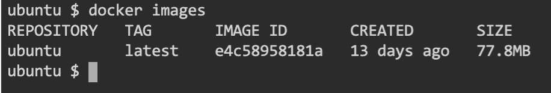
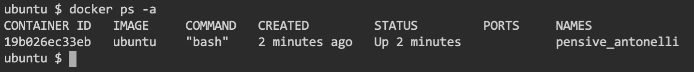
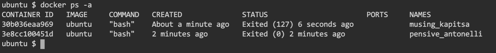

  You can use the *docker images* command to check which images are available in the local repository. Please try it now:
  ```
  docker images
  ```{{exec}}

You should not have any image so far

### **Downloading images from a repository**

The *docker pull* command downloads images from a Docker registry. 
  
The command has the following syntax: 

> docker pull [OPTIONS] NAME[:TAG|@DIGEST]

where: 

- OPTIONS are options to provide to *docker pull*. You can specify --all-tags to download all tagged images and --quiet to suppress verbose output
- NAME is the name of the image that you wand to download
- TAG provides the Tag for the image that you want to download. You can have several versions of an image under different Tags
- DIGEST provides an alternative way to identify the image that you want to download. Instead of providing the Tag you provide the Message Digest (SHA256 Hash)

By default, *docker pull* will get the images from Docker Hub. The NAME can be prefixed with the repository location if you want to use an alternate repository as in the example below

```
docker pull myregistry.example.com/myimage:latest
```

Execute the command to download the ubuntu image from Docker Hub

<details>
  <summary>Solution</summary>
  
  <br>

  You can execute the following command to download the ubuntu image from Docker Hub:

```
docker pull ubuntu
```{{exec}}

Because you provided no Tag it will download the latest version for the image.

</details>

Execute the *docker images* command again. This time you should find the ubuntu image



### **Creating and running containers**

Execute the following command:

```
docker ps -a
```{{exec}}

This command will show all the created containers. The *-a* flag is used to show all containers and not only the ones that are currently running. 

You should not have any container created yet. Use the 

```
docker run --help
```

command to obtain Help information about the *docker run* command. 

Using this returned information, execute the command to create and run a container from the *ubuntu* image. The *interactive* and *pseudo-tty* options shall be used and the container shall execute the *bash* shell. We also want to give extended privileges to the container.

<details>
  <summary>Solution</summary>
  
  <br>

  You can execute the following command to create and run the container:

```
docker run -it --privileged ubuntu bash
```{{exec}}
</details>

Click on the *+* button at the right of Tab1 to create another Tab (Tab2) and move to this new Tab.

On the new Tab, execute the following command:

```
docker ps -a
```{{exec}}

This time, you will find one Container Running, the one that you have just started



Execute **ls** on **Tab2** and run the same command on **Tab1**. How can you explain the differences? 

<details>
  <summary>Solution</summary>
  
  <br>
  The two outputs will be different. The one in Tab1 shows you the folders in the filesystem of the ubuntu image.

</details>

<br>


### **Mounting a volume into the container**

There are three ways to mount data into a container:

| Technique                     | Description                                                           |
| ----------------------------- | --------------------------------------------------------------------- |
| **Bind Mount**                | You specify a path on the host system, and Docker mounts the content of the path into the container.   |
| **Docker Volume**             | You define the volumes and use the containers                         |
| **tmpfs mount**               | You mount an in-memory file system into the Docker container                         |


#### **1. Bind Mounts**

To use a Bind Mount, use the **-v** or **--volume** option in the docker run command

> docker run -v host_path:container_path image_name

Let's try it. Start by exiting the running container. In **Tab1** execute

```
exit
```{{exec}}

to exit the container and return to the Host.

Now, create a folder called myDir and create a the *myFile.txt* file there.

```
mkdir myDir
```{{exec}}

Then, execute the following command to start a container and mount this folder in the **/mydir** location in the container

```
docker run -it -v /myDir:/mydir ubuntu bash
```{{exec}}

Create the abcd.txt file in the container (Tab1) and exit the container

```
touch /mydir/abcd.txt
```{{exec}}

```
exit
```{{exec}}

List the /myDir folder in the Host. You will see the abcd.txt file.

```
ls /myDir
```{{exec}}

Now, start another container and mount the volume. Then check if the abcd.txt file is there. It should be.

```
docker run -it -v /myDir:/mydir ubuntu bash
ls /mydir
```{{exec}}

and execute *exit* to quit and terminate the container

```
exit
```{{exec}}

Execute *docker ps* without arguments. You shall not see any container brcause it only lists the ones currently running

```
docker ps
```{{exec}}

Now, repeat the same command including the *-a* flag. You will be able to see that there are containers stopped

```
docker ps -a
```{{exec}}



#### **2. Docker Volumes**

You use *docker volume* commands to create and manage volumes. The syntax is:

> docker volume *desired_operation*

Execute the following comman to see all the options:

```
docker volume --help
```{{exec}}

Use the *create* option to create a volume named *myvolume*

<details>
  <summary>Solution</summary>
  
  Use the following command:

```
docker volume create myvolume
```{{exec}}

</details>

You can mount the volume into a container using the same syntax that you saw for bind mounts. The difference is in the name: Include the docker volume name instead of providing the path to the host folder.

Execute the following command to start a container and mount your volume there in the *myvol* folder:

```
docker run -it -v myvolume:/myvol ubuntu bash
```{{exec}}

Now, switch to Tab2 and start another container mounting the same volume in the same location

```
docker run -it -v myvolume:/myvol ubuntu bash
```{{exec}}

