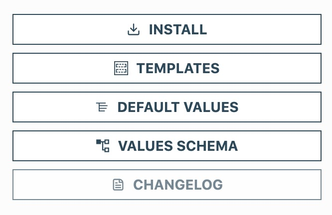
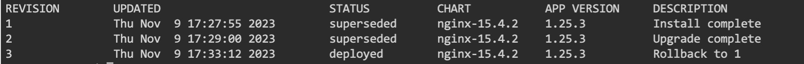

We will start by installing Helm in the current node

Execute the following command to install Helm:

```
sudo snap install helm --classic
```{{exec}}

Execute the following command to check the Helm version. You should be using Helm 3.

```
helm version
```{{exec}}

Create a new namespace that we are going to use in our exercises

```
kubectl create namespace helm-exercises
```{{exec}}

Change the Helm environment to use this namespace. We start by checking the current namespace

```
helm env | grep NAMESPACE
```{{exec}}

Then, execute the following command to change it to our helm-exercises namespace

```
export HELM_NAMESPACE=helm-exercises
```{{exec}}


Go to the [Artifact Hub site](https://artifacthub.io) and search for nginx. One of the entries shows that the Chart is available in the Bitnami repository. 

> You can also execute the helm search hub nginx command to perform this type of search

Execute the following command to check the syntax of the helm add repo command

```
helm repo add --help
```{{exec}}

Click on the entry for the nginx Chart. You will see a small menu on the right



You can use the menu to access the Templates in the Chart, the default values in the values.yaml in the Chart and to obtain information on how to use the Chart to perform an installation. 

Click on the **Install** entry. It shows you how to add the Bitnami repository. For convenience, I copied the command here. Execute the command to add the Bitnami repository

```
helm repo add bitnami https://charts.bitnami.com/bitnami
```{{exec}}

Execute the following command to verify that the Bitnami repository is now available to us

```
helm repo list
```{{exec}}

Execute the following command to search for nginx related Charts in the Bitnami repository

```
helm search repo nginx
```{{exec}}

Now, execute the following command to examine the nginx Chart

```
helm show chart bitnami/nginx
```{{exec}}

Let's see the README information contained in the Chart. Execute: 

```
helm show readme bitnami/nginx | more
```{{exec}}

You can also see the default values used by the chart using 

```
helm show values bitnami/nginx | more
```{{exec}}

Now, let's see the manifest YAML that is generated when we use the Chart. To do this, execute the following command:

```
helm template bitnami/nginx | more
```{{exec}}

Now we are going to install a nginx instance using the Chart. Execute the following command to install nginx using the bitnami/nginx Chart and override the defaults to use a LoadBalancer service available at NodePort 30369


```
helm install my-nginx bitnami/nginx --set service.type=LoadBalancer \
--set service.nodePorts.http=30369
```{{exec}}

Wait a little bit and then, execute the following command to see the Kubernetes resources deployed to the helm-exercises namespace:

```
kubectl get all -n helm-exercises
```{{exec}}

You shall have a Pod, a Service, a Deployment and a ReplicaSet created. Wait till you see the Pod running. Repeat the command untill you see it running. 

Use the link below. You should be able to reach NGINX by using it. 

[Use this link to reach nginx at port 30369]({{TRAFFIC_HOST1_30369}})

Use the following command to show the application releases

```
helm list
```{{exec}}

Now, let's upgrade the release to use a different NodePort

```
helm upgrade my-nginx bitnami/nginx --set service.type=LoadBalancer \
--set service.nodePorts.http=30370
```{{exec}}

Use the following command to see the Kubernetes resources in the helm-exercises namespace. You will see the old resources being removed and the new resources being added. Repeat the command until you find that the new release is installed and operational

```
kubectl get all -n helm-exercises
```{{exec}}

Then, use the link below. You should be able to reach NGINX in the new NodePort. 

[Use this link to reach nginx at port 30370]({{TRAFFIC_HOST1_30370}})

Repeat the 


```
helm list
```{{exec}}

command. You should now see the rew release (Revision = 2)

Execute the following command to see the release history

```
helm history my-nginx
```{{exec}}

Now, you see both revisions and revision 1 should be superseeded by revision 2. Execute the following command to go back to the first revision

```
helm rollback my-nginx 1
```{{exec}}

Repeat the 


```
helm list
```{{exec}}

command. You should now see a new revision that is the result of the rollback. Execute the following command to see the history

```
helm history my-nginx
```{{exec}}

You shall get an output similar to the following: 



It shows that you add an initial revision, upgraded to use a different NodePort and returned back to the first NodePort using the rollback command. You can check that this is happening by using the following link

[Use this link to reach nginx at port 30369]({{TRAFFIC_HOST1_30369}})

Now, use Helm to remove the Kubernetes Application. Execute the following command:

```
helm uninstall my-nginx
```{{exec}}

Use the helm list command. You should not see the release anymore.

```
helm list
```{{exec}}

### Congratulations! You finished the first step.
